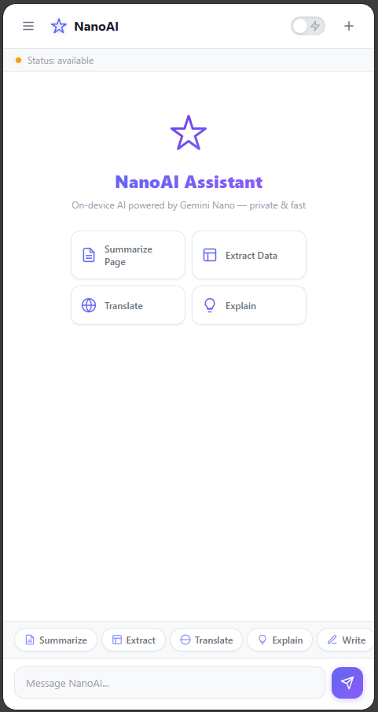

# NanoAI - Chrome Extension 🚀🤖

NanoAI is a powerful, locally-run Chrome Extension that leverages Google Chrome's built-in (hidden) AI model, **Gemini Nano**, via the experimental `window.ai` (Prompt API). It acts as both a conversational assistant and an autonomous web agent right inside your browser!

Since the AI runs 100% locally on your device, it is extremely fast and completely private—no data ever leaves your computer. 🔒

## ✨ Features

- **100% Local & Private:** Powered by Chrome's on-device Gemini Nano model.
- **Conversational Assistant:** Chat, summarize text, or ask questions based on the current webpage context.
- **Autonomous Web Agent:** Can read the DOM and perform automated actions like clicking buttons, filling forms, and scrolling.
- **Seamless Integration:** Operates smoothly via a beautiful sidebar interface.

## 🛠️ Installation & Setup Guide

### Step 1: Enable Chrome's Built-in AI (Gemini Nano)
To use this extension, you must first enable the experimental AI features in Google Chrome:

1. Open a new tab and go to `chrome://flags/#optimization-guide-on-device-model`.
2. Set the flag to **Enabled BypassPrefRequirement**.
3. Next, go to `chrome://flags/#prompt-api-for-gemini-nano`.
4. Set the flag to **Enabled**.
5. **Relaunch** your Chrome browser.
6. *Wait a few minutes* (3-5 mins) with the browser open to allow Chrome to download the AI model in the background.
7. To verify the download, go to `chrome://components` and check for the **Optimization Guide On Device Model** component to ensure it is updated.

### Step 2: Install the Extension
1. Clone or download this repository and unzip it.
2. Go to the Chrome Extensions page by typing `chrome://extensions/` in your address bar.
3. Turn on **Developer mode** (toggle switch in the top right corner).
4. Click on the **Load unpacked** button in the top left.
5. Select the unzipped folder of this project.
6. The NanoAI extension is now installed and ready to use! 🎉

## 💻 How It Works
- **Content Script (`content.js`):** Interacts with the active webpage, reads the DOM, and executes agent commands (click, scroll, type).
- **Background Script (`background.js`):** Acts as the bridge. It securely communicates with the local `window.ai` Prompt API to generate AI responses without relying on external servers.
- **Sidebar Interface:** A user-friendly chat interface built with HTML/CSS/JS.

## 🤝 Contributing
Contributions, issues, and feature requests are welcome! Feel free to check the [issues page](https://github.com/hellokhorshedalam/NanoAI/issues) if you want to contribute.

---
*Built with ❤️ using Chrome's built-in AI.*
